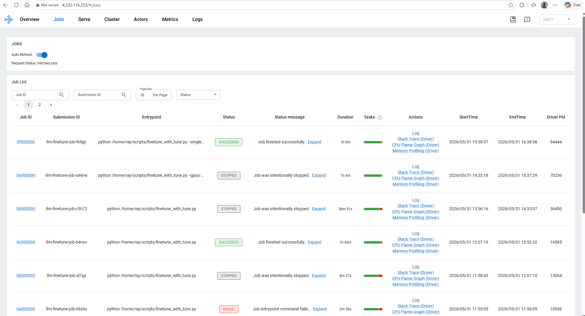
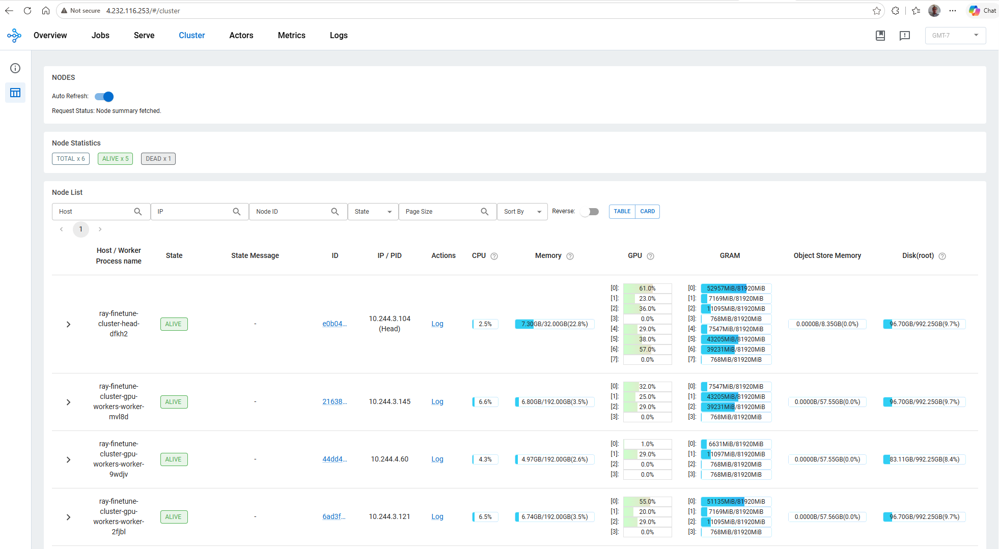

# LLM Fine-tuning with Ray Train + Ray Tune on AKS Automatic

This sample demonstrates how to fine-tune Large Language Models (LLMs) on AKS Automatic using Ray Train for distributed training and Ray Tune for hyperparameter optimization.

## Overview

The sample provides:
- **Distributed Training**: Scale fine-tuning across multiple A100 GPUs using Ray Train
- **Hyperparameter Tuning**: Automatically find optimal hyperparameters using Ray Tune
- **Memory Efficiency**: QLoRA (4-bit quantization) + LoRA for efficient fine-tuning
- **AKS Automatic**: Simplified cluster management with automatic GPU node provisioning

### Architecture

```
┌─────────────────────────────────────────────────────────────────┐
│                     AKS Automatic Cluster                        │
├─────────────────────────────────────────────────────────────────┤
│                      GPU Workload Pool                           │
│                    (A100 GPU Nodes)                              │
│                  Label: accelerator=nvidia                       │
│                                                                  │
│  ┌────────────────────┐    ┌───────────────────────────────┐    │
│  │ Ray Head Pod       │    │ Ray Worker Pod (GPU)          │    │
│  │ - Dashboard (8265) │◄───│ - Training Workers            │    │
│  │ - GCS (6379)       │    │ - QLoRA Fine-tuning           │    │
│  │ - Tune Controller  │    │ - 4x A100 GPUs                │    │
│  │ - 8 CPU, 32Gi RAM  │    │ - 48 CPU, 192Gi RAM           │    │
│  └────────────────────┘    └───────────────────────────────┘    │
│                                                                  │
│  ┌─────────────────────────────────────────────────────────┐    │
│  │  Ray Tune                                                │    │
│  │  - ASHA Scheduler (Early stopping)                      │    │
│  │  - Optuna Search Algorithm                              │    │
│  │  - Parallel trial execution                             │    │
│  └─────────────────────────────────────────────────────────┘    │
└─────────────────────────────────────────────────────────────────┘
```

## Features

### Ray Train
- Distributed data-parallel training
- Automatic gradient synchronization
- Checkpoint management
- Fault tolerance with automatic recovery

### Ray Tune
- **ASHA Scheduler**: Early stops poorly performing trials
- **Optuna Search**: Smart hyperparameter sampling
- **Parallel Execution**: Run multiple trials concurrently

### QLoRA Fine-tuning
- 4-bit quantization for memory efficiency
- LoRA adapters for parameter-efficient training
- Supports models up to 70B parameters on A100 GPUs

## Hyperparameters Tuned

| Parameter | Search Space | Description |
|-----------|-------------|-------------|
| `lora_r` | [8, 16, 32, 64] | LoRA rank |
| `lora_alpha` | [16, 32, 64, 128] | LoRA scaling factor |
| `lora_dropout` | [0.0, 0.1] | LoRA dropout rate |
| `learning_rate` | [1e-5, 5e-4] | Learning rate (log scale) |
| `batch_size` | [1, 2, 4] | Per-device batch size |
| `gradient_accumulation` | [4, 8, 16] | Gradient accumulation steps |
| `epochs` | [1, 2, 3] | Number of training epochs |
| `warmup_ratio` | [0.01, 0.1] | Warmup ratio |
| `weight_decay` | [0.0, 0.1] | Weight decay |

## Prerequisites

1. Azure subscription with GPU quota for A100 VMs
2. Azure CLI, kubectl, Helm, and kubelogin installed
3. [Hugging Face](https://huggingface.co/) account and API token
4. **Azure Kubernetes Service RBAC Cluster Admin** role

## Quick Start

### 1. Configure the Setup Script

Edit `setup-aks-raytune-finetune.sh`:

```bash
SUBSCRIPTION_ID="your-subscription-id"
RESOURCE_GROUP="your-resource-group"
CLUSTER_NAME="your-cluster-name"
LOCATION="your-region"  # e.g., italynorth, eastus2
HF_TOKEN="your-huggingface-token"
```

### 2. Run the Setup Script

```bash
cd finetuning
chmod +x setup-aks-raytune-finetune.sh
./setup-aks-raytune-finetune.sh
```

This will:
1. Create an AKS Automatic cluster with GPU nodes
2. Install the KubeRay operator
3. Deploy a Ray cluster for fine-tuning
4. Create the fine-tuning script ConfigMap

### 3. Submit a Fine-tuning Job

```bash
# Submit the Ray Job for hyperparameter tuning
kubectl apply -f ray-job.finetune.yaml

# Monitor the job
kubectl logs -f -l ray.io/job-name=llm-finetune-job
```

### 4. Access Ray Dashboard

```bash
# Get the dashboard URL
DASHBOARD_IP=$(kubectl get svc ray-finetune-dashboard-lb -o jsonpath='{.status.loadBalancer.ingress[0].ip}')
echo "Ray Dashboard: http://${DASHBOARD_IP}"
```

## Configuration Options

### Fine-tuning Script Arguments

```bash
python finetune_with_tune.py [OPTIONS]

Options:
  --model MODEL          Hugging Face model ID (default: Qwen/Qwen2.5-3B)
  --num-samples N        Number of hyperparameter combinations (default: 10)
  --num-workers N        Workers per trial (default: 1)
  --gpus-per-worker N    GPUs per worker (default: 4)
  --single-run           Run single training (no tuning)
```

### Custom Hyperparameter Search

Edit `finetune_with_tune.py` to customize the search space:

```python
TUNE_CONFIG = {
    "lora_r": tune.choice([8, 16, 32, 64]),
    "lora_alpha": tune.choice([16, 32, 64, 128]),
    "learning_rate": tune.loguniform(1e-5, 5e-4),
    # Add more hyperparameters...
}
```

### Custom Dataset

Replace the `prepare_dataset()` function in `finetune_with_tune.py`:

```python
def prepare_dataset(tokenizer, max_length=512):
    # Load your custom dataset
    dataset = load_dataset("your-org/your-dataset")
    # Process as needed
    return dataset
```

## Files

| File | Description |
|------|-------------|
| `setup-aks-raytune-finetune.sh` | AKS cluster setup script |
| `ray-cluster.finetune.yaml` | Ray cluster configuration |
| `ray-job.finetune.yaml` | Ray Job for fine-tuning |
| `ray-job.push.yaml` | Ray Job to push an existing checkpoint to the HF Hub |
| `ray-job.compare.yaml` | Ray Job to compare base vs fine-tuned model |
| `finetune_with_tune.py` | Fine-tuning script with Tune (inline HF push via `INLINE_PUSH_*` envs) |
| `push_to_hub.py` | Standalone CLI to merge a LoRA adapter and push to HF Hub |
| `compare_inference.py` | Compare base vs adapter / merged model on Alpaca prompts |
| `comparison.json` | Latest comparison summary (committed for reference) |

## Results

Fine-tuned `Qwen/Qwen2.5-3B` on `tatsu-lab/alpaca` (10k samples, 1 epoch, LoRA r=16) and pushed the merged model to [`chengliangli/qwen2.5-3b-alpaca`](https://huggingface.co/chengliangli/qwen2.5-3b-alpaca). Comparison on 20 held-out Alpaca prompts:

| Metric | Base (Qwen2.5-3B) | Fine-tuned | Δ |
|---|---:|---:|---:|
| Avg perplexity | 3.37 | **2.88** | −0.49 (−14%) |
| Avg ROUGE-L F1 | 0.298 | **0.392** | +0.094 (+31%) |
| Avg latency / prompt | 4.86 s | **2.76 s** | −43% |
| Tokens / sec | 23.0 | 23.1 | ≈same |

The fine-tuned model produces shorter, more on-target responses in the Alpaca instruction style — the latency drop comes from fewer generated tokens (same throughput), not from a faster model. Full raw summary in [comparison.json](./comparison.json).

Example (prompt #20 — _"Edit this sentence to make it sound more professional: 'I can help you out more with this task'"_):

- **Base** (ppl 2.50, ROUGE-L 0.667): _"I can provide you with more assistance regarding this task."_
- **Fine-tuned** (ppl 1.87, ROUGE-L 0.632): _"I am more than willing to assist you with this task."_
- **Reference**: _"I can assist you further with this task."_

To reproduce:

```bash
# 1. fine-tune + inline-push merged model to HF (set INLINE_PUSH_REPO_ID in ray-job.finetune.yaml)
kubectl apply -f ray-job.finetune.yaml

# 2. compare base vs your fine-tuned model
kubectl apply -f ray-job.compare.yaml
kubectl logs -f $(kubectl get pod -l job-name=llm-compare-inference -o name | head -1)
```

## Monitoring

### Ray Dashboard

The Ray Dashboard provides:
- **Jobs**: View running and completed fine-tuning jobs
- **Tune**: Monitor hyperparameter trials and results
- **Cluster**: Check node and resource utilization
- **Logs**: View training logs for each trial

**Jobs** — live status of the fine-tuning RayJob and its Tune trials:



**Cluster** — Ray head and GPU worker nodes registered with the cluster:



### Kubernetes Logs

```bash
# View Ray head logs
kubectl logs -l ray.io/cluster=ray-finetune-cluster,ray.io/node-type=head

# View Ray worker logs
kubectl logs -l ray.io/cluster=ray-finetune-cluster,ray.io/node-type=worker

# View specific job logs
kubectl logs -l ray.io/job-name=llm-finetune-job
```

## Estimated Resources

| Component | CPU | Memory | GPU |
|-----------|-----|--------|-----|
| Ray Head | 4-8 | 16-32 Gi | 0 |
| Ray Worker | 32-48 | 128-192 Gi | 4x A100 |
| Per Trial | - | ~40 Gi | 4x A100 |

**Note**: For parallel trials, multiply worker resources by the number of concurrent trials.

## Troubleshooting

### Out of Memory

Reduce batch size or gradient accumulation:
```python
"per_device_train_batch_size": tune.choice([1]),
"gradient_accumulation_steps": tune.choice([16, 32]),
```

### Slow Training

- Increase `max_seq_length` in the script
- Use a smaller model for initial testing
- Reduce `num_samples` for faster exploration

### GPU Not Found

```bash
# Verify GPU nodes are ready
kubectl get nodes -l accelerator=nvidia

# Check GPU resources
kubectl describe node <gpu-node-name> | grep nvidia
```

## References

- [Ray Train with Transformers](https://docs.ray.io/en/latest/train/getting-started-transformers.html)
- [Ray Tune Documentation](https://docs.ray.io/en/latest/tune/index.html)
- [PEFT/LoRA Guide](https://huggingface.co/docs/peft/main/en/index)
- [QLoRA Paper](https://arxiv.org/abs/2305.14314)
- [AKS Automatic](https://learn.microsoft.com/azure/aks/intro-aks-automatic)
